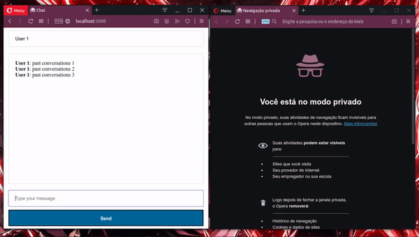

# Chat

This project is a simple web chat made with NodeJS and socket.io.

## Features

* Real time chat.
* Get previous messages.
* Broadcast a message to connected users when someone connects or disconnects.

## TO DO

* DB Data storage.
* Add “{user} is typing” functionality.
* Show who’s online.

## Installation

First you need to install NodeJS and NPM

> $ npm install

## Usage

> $ npm start

In your browser open multiple tabs in [http://localhost:3000](http://localhost:3000)
